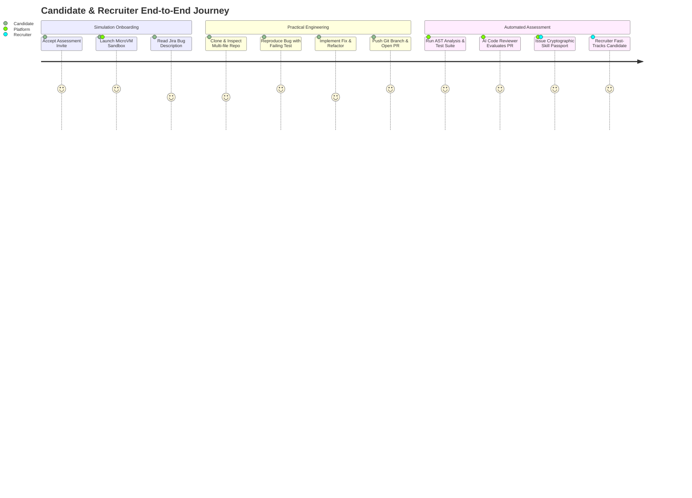
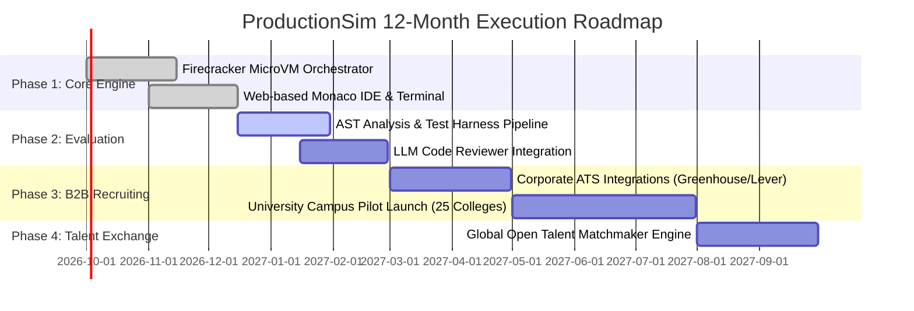

# Product Requirements Document (PRD) & Technical Architecture Blueprint

**Product Name:** ProductionSim (DevLab Engine)  
**Initiative:** Practical Coding & Industry Simulation Platform for CS Graduates  
**Evaluation Score:** ITCH Score 86.5 | Severity 9.0 | TAM 9.0 | Whitespace 8.5 | Frequency 7.0  
**Target Category:** EdTech / Enterprise Tech Recruiting  
**Version:** 1.0.0 (Production-Ready)  

---

## 1. Executive Summary & Problem Thesis

### 1.1 The Core Industry Failure

Every year, over 1.5 million computer science and engineering students graduate in emerging tech markets. Despite maintaining high GPAs and solving algorithmic leetcode questions, **over 85% of fresh graduates are unemployable on Day 1 in modern engineering teams**.

* **What Colleges Teach**: Isolated algorithm puzzles, single-file scripts (`main.c`, `App.java`), theoretical whiteboard complexity, and synthetic clean-room problems.
* **What Industry Demands**: Navigating 200,000-line legacy microservice architectures, diagnosing intermittent race conditions, writing resilient unit/integration tests, resolving git merge conflicts, reading unstructured stack traces, and handling production deployments under observability constraints.

### 1.2 The ProductionSim Vision

ProductionSim is an automated **"Flight Simulator for Software Engineers"**. It drops candidates into realistic, ephemeral multi-tier production codebases (e.g., a broken e-commerce payments service or an incident-stricken distributed cache), assigns them realistic Jira tickets and mock Slack incident alerts, and objectively evaluates their hands-on engineering instincts.

---

## 2. Market Sizing & Opportunity Validation

* **Total Addressable Market (TAM)**: **$14.8B** (Global Developer Assessment, Tech Upskilling & University CS Lab Infrastructure).
* **Serviceable Addressable Market (SAM)**: **$3.2B** (Technical campus recruitment & pre-hire assessment platforms in India, Southeast Asia, and LATAM).
* **Serviceable Obtainable Market (SOM)**: **$420M** (First 36 months targeting 200 top hiring enterprises and 150 tier-1/tier-2 engineering universities).

---

## 3. User Personas & Core Journeys



### Persona A: The Aspiring Engineer ("Arjun", 22, CS Senior)

* **Pain Point**: Solved 300+ LeetCode problems, but gets rejected in technical interviews because he has never read an OpenTelemetry trace, used Redis locks, or debugged a Dockerized service.
* **Desired Outcome**: A verifiable, objective credential demonstrating he can ship clean code into production on Day 1.

### Persona B: The VP of Engineering ("Sarah", High-Growth SaaS)

* **Pain Point**: Sifts through 2,000 identical resumes with high GPAs; spends 45 engineer-hours per week on live coding interviews where candidates fail basic git commands or error handling.
* **Desired Outcome**: A pre-screened talent pipeline evaluated on actual code hygiene, debugging efficiency, and architectural reasoning.

---

## 4. System Architecture & Component Design

```mermaid
graph TD
    Client[Browser / Monaco Web IDE & Terminal] -->|WebSocket / gRPC| Gateway[Edge API Gateway]
    Gateway --> Auth[Supabase Auth & Session Verifier]
    Gateway --> Orchestrator[Sandbox Orchestrator Engine]
    
    subgraph Compute Isolation Layer
      Orchestrator --> FirecrackerPool[Firecracker MicroVM / gVisor Cluster]
      FirecrackerPool --> Sandbox1[Ephemeral Sandbox: Node/Go/Postgres]
      FirecrackerPool --> Sandbox2[Ephemeral Sandbox: Python/FastAPI/Redis]
    end
    
    subgraph Automated Evaluation Pipeline
      Sandbox1 -->|Git Push Hook| Evaluator[Evaluation Engine]
      Evaluator --> ASTEngine[Tree-sitter AST & Complexity Analyzer]
      Evaluator --> TestRunner[Isolated Test Harness & Coverage Auditor]
      Evaluator --> LlmReviewer[LLM Senior Staff Reviewer Agent]
    end
    
    subgraph Intelligence & Credentialing
      Evaluator --> ScoreEngine[ITCH Multi-Vector Scoring Engine]
      ScoreEngine --> PassportDB[(Postgres / Supabase Store)]
      ScoreEngine --> TalentAPI[Recruiter ATS API / Webhooks]
```

### 4.1 Ephemeral MicroVM Sandbox Infrastructure

1. **Isolation Model**: Each challenge session provisions a lightweight **Firecracker MicroVM** (or gVisor sandbox) within 450ms, containing:
   * Full Linux environment (Ubuntu 24.04 minimal).
   * Real multi-container runtime via Rootless Podman / Docker-in-Docker.
   * Pre-cloned legacy repository with real git history (50+ commits, multiple contributors).
   * Seeded database (PostgreSQL / Redis / SQLite) with realistic dirty data.
2. **Network Isolation**:
   * Zero outbound internet access (prevents external code leaking, cryptomining, or reverse shells).
   * Internal virtual bridge to mock microservices and third-party APIs (e.g. simulated Stripe, AWS S3, Twilio).

### 4.2 Automated Multi-Vector Evaluation Engine

Instead of binary pass/fail unit tests, ProductionSim grades candidate performance on an enterprise rubric:

| Evaluation Dimension | Weight | Metrics Analyzed |
| :--- | :---: | :--- |
| **Debugging Velocity** | 25% | Time from ticket assignment to first breakpoint, pinpointing root cause in stack trace. |
| **Regression & Test Hygiene** | 20% | Did the candidate write a reproducing test before modifying source code? Test assertions quality. |
| **Code Smells & Complexity** | 20% | Cyclomatic complexity delta, memory safety, boundary checks, and dead-code elimination. |
| **Git Hygiene & Collaboration** | 15% | Atomic commits, descriptive commit messages, branch naming, and clear PR review descriptions. |
| **Architectural Coherence** | 20% | Adherence to existing repository patterns, modularity, dependency management, and error handling. |

---

## 5. Data Schema & Core Tables

```sql
-- ProductionSim Core Data Schema
CREATE TABLE public.sim_scenarios (
    id UUID PRIMARY KEY DEFAULT gen_random_uuid(),
    slug TEXT UNIQUE NOT NULL,
    title TEXT NOT NULL,
    difficulty TEXT CHECK (difficulty IN ('entry', 'mid', 'senior')),
    stack TEXT[] NOT NULL, -- e.g. ['TypeScript', 'React', 'NodeJS', 'PostgreSQL']
    repo_template_url TEXT NOT NULL,
    jira_ticket_brief JSONB NOT NULL,
    acceptance_tests JSONB NOT NULL,
    base_score NUMERIC(5,2) DEFAULT 100.00
);

CREATE TABLE public.sim_sessions (
    id UUID PRIMARY KEY DEFAULT gen_random_uuid(),
    user_id UUID REFERENCES auth.users(id),
    scenario_id UUID REFERENCES public.sim_scenarios(id),
    sandbox_container_id TEXT,
    status TEXT CHECK (status IN ('provisioning', 'in_progress', 'submitted', 'evaluated')),
    started_at TIMESTAMPTZ DEFAULT now(),
    submitted_at TIMESTAMPTZ,
    telemetry_logs JSONB DEFAULT '{}'::jsonb
);

CREATE TABLE public.sim_evaluations (
    id UUID PRIMARY KEY DEFAULT gen_random_uuid(),
    session_id UUID REFERENCES public.sim_sessions(id) UNIQUE,
    debugging_score NUMERIC(5,2) NOT NULL,
    test_hygiene_score NUMERIC(5,2) NOT NULL,
    code_quality_score NUMERIC(5,2) NOT NULL,
    git_hygiene_score NUMERIC(5,2) NOT NULL,
    architectural_score NUMERIC(5,2) NOT NULL,
    composite_score NUMERIC(5,2) NOT NULL,
    ai_staff_review TEXT NOT NULL,
    created_at TIMESTAMPTZ DEFAULT now()
);
```

---

## 6. Business Model & Monetization

1. **B2B Pre-Hire Assessment & Talent Marketplace**:
   * **Subscription Tier**: $499 – $2,499/month per tech recruitment team (includes customized company repo simulations).
   * **Placement Success Fee**: $500 per engineer hired who passed with a Composite Score > 85.
2. **B2C Pro Career Accelerator**:
   * **Student Pass**: $19/month or ₹999/month granting access to 50+ enterprise repo scenarios and an exportable verified GitHub Skill Badge.
3. **B2B University & Academic Licensing**:
   * **Department License**: $35/student/semester replacing stale offline lab exams with continuous real-world continuous deployment labs.

---

## 7. 12-Month Product Roadmap



* **Q1: MVP Launch**: 10 Production scenarios (Full-Stack TypeScript & Python/FastAPI) + Instant AI evaluation report.
* **Q2: Enterprise Pilot**: 5 SaaS hiring partners replacing technical phone screens with 60-minute ProductionSim challenges.
* **Q3: Academic Partnerships**: 25 engineering universities adopting the platform for graded coursework labs.
* **Q4: Global Talent Exchange**: Direct employer-to-candidate discovery based on verified problem-solving telemetry.
